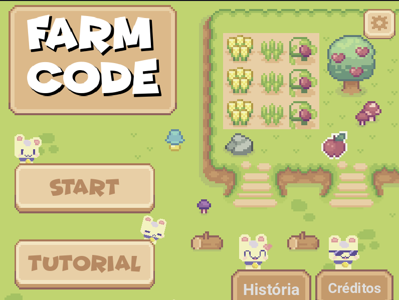

# FarmCode

A block based game created as part of a university course.

# Dependencies

- [Godot 4.1.1.stable.mono](https://godotengine.org/)

The game was initially created using GDScript, but it has been ported to C#.

# Playing

You play as a farmer who must tend to the farm by completing tasks to assist the townsfolk. 

The game's style draws inspiration from 'cozy' games I enjoy.

**You can play the game here**: mochaeng.itch.io/farmcode

